# Hebrew Live Dictation Architecture

## Product Goal

Hebrew Live Dictation v1 Beta brings a practical Gboard-like Hebrew dictation workflow to Windows. It is intentionally not marketed as full Gboard parity: Android Gboard is a system keyboard/IME with deep composition support, while v1 is a desktop app that commits final text into the active Windows target.

The product promise for v1 is:

- Hebrew-first dictation on Windows.
- Google Speech-to-Text V2 with Chirp 3.
- Stable final-only external commits, with live interim typing exposed as an experimental option.
- Local spoken punctuation, emoji phrases, and session-scoped editing commands.
- Clear privacy defaults and clean public-beta packaging.

True live composition-string behavior is reserved for v2 through Microsoft TSF/IME.

## Runtime Flow

```mermaid
flowchart LR
    Mic["AudioSource\nsounddevice RawInputStream"] --> VAD["Optional local VAD\nring buffer + padding"]
    VAD --> STT["SpeechClient\nGoogle STT V2 Chirp 3"]
    STT --> Events["STT events\ninterim/final/speech_start/speech_end/error/status"]
    Events --> Controller["DictationController\nsentence accumulation + endpointing"]
    Controller --> Commands["CommandParser\nlocal command packs"]
    Commands --> Committer["TextCommitter\nfinal-only commit"]
    Committer --> Target["Windows target app\nWord/Notepad/browser/etc."]
```

## Main Modules

- `src/hebrew_live_dictation/config.py`: schema v4 settings, migration, normalization, defaults.
- `src/hebrew_live_dictation/audio_stream.py`: 16 kHz LINEAR16 microphone capture, 100 ms frames by default.
- `src/hebrew_live_dictation/vad.py`: optional local RMS-based VAD gate with pre-roll and speech padding.
- `src/hebrew_live_dictation/google_stt_v2_stream.py`: Google Speech-to-Text V2 streaming, Chirp 3, endpointing, fallback, stream rotation.
- `src/hebrew_live_dictation/dictation_controller.py`: application state, event handling, final-only accumulation.
- `src/hebrew_live_dictation/language_packs.py`: punctuation, emoji phrases, and supported voice commands.
- `src/hebrew_live_dictation/text_injector.py`: session-scoped insertion, undo/delete/replace, Word/UIA/Unicode keyboard paths.
- `src/hebrew_live_dictation/qt_app.py`: the only public UI, including tray and no-focus overlay.

## Public Interfaces

The stable internal contracts are defined in `src/hebrew_live_dictation/interfaces.py`:

- `AudioSource`
- `SpeechClient`
- `TextCommitter`
- `CommandParser`
- `STTEvent`

Supported STT event types are:

- `interim`
- `final`
- `speech_start`
- `speech_end`
- `error`
- `status`

## Configuration Contract

Schema v4 is the v1 Beta contract. Important defaults:

- `google.api_version`: always normalized to `v2`.
- `google.location`: `eu`.
- `google.fallback_location`: `us`.
- `google.model`: `chirp_3`.
- `google.fallback_model`: `chirp_3`.
- `languages.primary`: `iw-IL`.
- `dictation.input_backend`: `v1`.
- `dictation.live_typing_mode`: `final_only`, with `live` available as an experimental UI option.
- `audio.sample_rate`: `16000`.
- `speech.frame_ms`: `100`.
- `speech.endpointing`: `true`.
- `speech.auto_stop_on_silence`: `false`; dictation stays active until manual stop by default.
- `speech.max_stream_seconds`: `285`.
- `speech.vad_enabled`: `false`.
- `tsf.handshake_timeout_ms`: `100`.
- `tsf.experimental_transport_enabled`: `false`.

Local user settings are created only under `%APPDATA%\VoiceType\settings.json`. The repository ships `settings.example.json` only.

## Google STT Rules

v1 supports one STT path:

- Google Speech-to-Text V2.
- Chirp 3 model id: `chirp_3`.
- Primary region: `eu`.
- Fallback: `us / chirp_3`.
- Recognition audio: `LINEAR16`, mono, `16 kHz`.
- Streaming frame size: `100 ms` by default.
- If the selected microphone rejects 16 kHz, capture falls back to the device default sample rate and is resampled to 16 kHz before streaming.
- Streaming request chunks: below `25 KB`.
- Stream rotation: before the 5 minute limit.
- Google voice activity events are enabled when available. Google speech timeouts are sent only when the user enables automatic stop after silence.

Google spoken punctuation/spoken emoji are not exposed in the v1 UI because Chirp model behavior differs by model and locale. The app provides local command packs for spoken punctuation and emoji phrases.

## Commands Supported in v1

Supported command groups:

- Punctuation and new line/new paragraph.
- Emoji phrases.
- Stop dictation.
- Delete last word.
- Delete last sentence.
- Clear all session text.
- Undo session edit.
- Send/Enter.
- Next field/Tab.
- Replace phrase within current dictation session.
- Delete phrase within current dictation session.

Unsupported commands are intentionally absent. In particular, arbitrary `select phrase` is not supported in v1 because reliable cross-application selection requires a deeper editor/IME integration.

## Privacy

Default behavior:

- Credentials paths are redacted in logs.
- Transcript content is not logged unless debug transcript logging is explicitly enabled.
- Injector diagnostics store lengths and action metadata, not transcript text, in normal logs.
- Runtime logs live under `%APPDATA%\VoiceType`.
- The release audit blocks local settings, logs, caches, personal paths, and common secret patterns.

## Live Typing Boundary

The `live` mode inserts interim text into the active application while speech is still being recognized. It is useful for fast feedback, but it remains experimental in v1 because plain Windows text injection cannot behave like a real IME composition string in every RTL field.

For release confidence, `final_only` remains the recommended and default mode.

## v2 Direction

The correct route for true Gboard-style live composition on Windows is Microsoft Text Services Framework. v2 must start as a separate TSF/IME architecture spike rather than a direct replacement for the Python beta.

v2 design rules:

- Python remains the source of truth for audio, Google STT, settings, privacy, and fallback.
- TSF is optional and enabled only after a fast compatibility handshake succeeds.
- Protected apps, AppContainer/UWP targets, IPC failures, focus loss, stale composition, or uncertain edit scope must fail closed to the v1 final-only path.
- Advanced editing commands may mutate only verified current-session text, never arbitrary historical text in third-party apps.
- TSF registration is never performed by normal app startup. Native registration is a separate explicit, dry-run-first maintenance action with symmetrical unregister.
- TSF focus/context access is isolated to a verified active dictation target and generation.
- v2 Native source includes both `VoiceTypeTsfHelloPeer.exe` and the in-process `VoiceTypeTsfTextService.dll`. The DLL reads the active Python session advertisement from `%APPDATA%\VoiceType\tsf_session.json`, performs the framed IPC hello, and applies composition updates only through TSF edit sessions.
- Advanced speech settings expose additional Google V2 presets, while the stable default remains `iw-IL / eu / chirp_3`.
- `final_only` remains the default until the TSF path passes the v2 compatibility matrix.

See [v2 TSF Risk Plan](v2_tsf_risk_plan.md) before implementing any TSF, composition, IPC, or advanced editing work.
