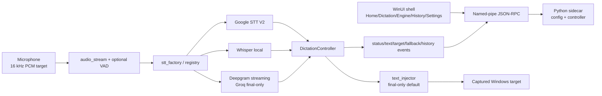

# VoiceType Architecture

This document describes the current WinUI branch. Older Qt/PySide architecture
notes are historical evidence only; the controlling completion ledger is
`docs/final-product-completion-plan.md`.

This document does not approve a public beta or release.

## Product Boundary

VoiceType is a Hebrew-first Windows dictation app. The stable product behavior is
final-only insertion into the active target: the user starts dictation, speaks,
stops, and the final transcript is committed once to the captured target.

Live words are display feedback in VoiceType surfaces such as the HUD and Remote.
They are not a promise of live composition in the target app. True IME-style live
composition remains a TSF/IME Labs track and is not part of the stable path.

## Process Model

The product runs as two cooperating processes:

- `VoiceType.exe`: WinUI 3 shell, rooms, HUD, Remote, tray, and diagnostics.
- Python engine sidecar: audio, STT providers, config, history, insertion, and
  provider diagnostics.

The shell communicates with the sidecar through a per-launch named-pipe JSON-RPC
bridge. The Python engine remains the source of truth for runtime config and
dictation behavior; the shell reads and writes settings only through bridge RPCs.

## Main Runtime Modules

- `src/hebrew_live_dictation/bridge/sidecar.py`: WinUI bridge adapter, config
  RPCs, status events, start guard, provider verification status, model and
  history RPCs.
- `src/hebrew_live_dictation/dictation_controller.py`: session state, STT event
  handling, final accumulation, history, and injection coordination.
- `src/hebrew_live_dictation/stt/registry.py` and
  `src/hebrew_live_dictation/stt_factory.py`: provider selection and fallback
  routing.
- `src/hebrew_live_dictation/google_stt_v2_stream.py`: Google Speech-to-Text V2
  streaming requests, response parsing, interims/finals, no-text failure
  surfacing, and Google fallback model/location behavior.
- `src/hebrew_live_dictation/stt/whisper_local.py`: local Whisper dictation.
- `src/hebrew_live_dictation/text_injector.py`: target capture and final text
  insertion via Word COM, UI Automation, Unicode keyboard, or clipboard paths.
- `src/hebrew_live_dictation/config.py`: schema defaults, migrations, and
  normalization.
- `winui/VoiceType.App/AppHost.cs`: shell-side bridge owner and event router.
- `winui/VoiceType.App/Views/EnginePage.xaml.cs`: provider/config UI.
- `winui/VoiceType.App/Overlays.cs`: HUD and Remote display surfaces.

## Configuration Truth

Important current defaults:

- `stt.provider`: provider selected by the engine room.
- `stt.mode`: `api`, `local`, `auto_fallback`, or `smart_auto`.
- `google.api_version`: normalized to `v2`.
- `google.location`: default `eu`.
- `google.model`: default `chirp_3`, but the R3-proven Google combo is
  `latest_long / eu / iw-IL / _`.
- `google.recognizer_id`: default `_`.
- `languages.primary`: default `iw-IL`.
- `dictation.live_typing_mode`: normalized to `final_only` in the WinUI beta
  path.
- `audio.sample_rate`: `16000`.
- `audio.feedback_enabled`: `false`.
- `audio.feedback_volume`: `50`.
- `speech.frame_ms`: `100`.
- `speech.auto_stop_on_silence`: `false`; manual stop is the default.
- `speech.endpointing`: `true`; cloud speech activity events may be sent when
  supported.
- `speech.vad_enabled`: `false`; local VAD is opt-in.
- `speech.vad_threshold`, `speech.vad_padding_ms`, and
  `speech.vad_min_silence_ms`: local energy gate controls.
- `providers.whisper.segment_silence_ms`: final segment boundary for local
  Whisper and Groq-style final-only segmentation.
- `tsf.experimental_transport_enabled`: `false`.

The Engine room's active-config line is the UI truth for what the runtime will
attempt. If it does not match engine logs, the logs win and the mismatch is a bug.

## Audio / VAD Rules

The Controls room owns microphone and advanced audio/VAD settings. It writes the
same keys consumed by `DictationController`, `AudioStream`,
`GoogleSTTV2Stream`, `WhisperLocalStream`, and the Groq segmenter.

For the beta line, the target speech sample rate stays fixed at 16 kHz. The
audio layer may open a Windows device at its native default rate and resample
back to the target rate, but the UI must not invite arbitrary sample-rate
changes until all providers prove that path. Manual stop remains the safe
default; automatic cloud stop is opt-in.

Optional start/stop feedback tones are a WinUI shell feature. The Controls room
writes `audio.feedback_enabled` and `audio.feedback_volume`; `AppHost` plays
short generated WAV tones on real session start and final idle return. Tone
playback is best-effort and must never block audio capture, STT streaming, or
final text insertion. Pause/resume does not play start/stop tones.

## Pause / Resume Rules

Pause/resume is session-preserving. The controller state moves
`listening -> paused -> listening` without returning to idle, without appending
history, and without resetting the insertion session. Pause suspends the current
audio and provider stream; resume opens a fresh stream under the same session id.

Provider callbacks are stamped with the session id and generation captured at
stream creation. A pause increments the generation so late events from the
pre-pause stream are ignored instead of being inserted or added to history.
Stopping from paused is the real session boundary: accumulated final text is
flushed once, then the sidecar emits idle and history can append the completed
transcript.

## Google STT V2 Rules

Google readiness has three separate meanings and they must not be collapsed:

- Credentials/config present: a key path, ADC, project, model, location, language,
  and recognizer are configured.
- Connection verified: the app could authenticate and validate the recognizer
  path for the current verification signature.
- Dictation proven: a real streaming transcription returned non-empty text for
  the exact runtime combo.

Test Connection is a connection/recognizer check. It is not proof that the
selected model/location/language will return transcripts or live words.

The current proven Google path for R3 regression protection is:

- provider: `google_v2`
- model: `latest_long`
- location: `eu`
- language: `iw-IL`
- recognizer: `_`

That proof protects the known working path, but it is not a blanket guarantee for
other Google projects, custom recognizers, regions, language aliases, or model
families. Advanced Google combinations remain diagnostic until a probe or real
dictation session returns non-empty text.

Chirp-family models are treated as final-only for product copy. Latest models are
also not assumed to support live words until real streaming responses contain
interims.

## Offline Rules

Offline dictation uses Whisper and is private/local after the selected model is
downloaded. The app must not claim offline dictation is ready unless the model's
on-disk completeness checks pass. The explicit download flow is the supported
acquisition path; hidden first-use downloads are not a readiness signal.

The model manager distinguishes `missing`, `incomplete`, `downloading`, and
`ready`. A cache directory, partial Hugging Face file, marker-only folder, or
zero-byte weights file must stay `incomplete`/not ready and offer a retry rather
than being treated as installed. A second download request while one is active is
refused instead of queued.

## Fallback Rules

Cloud engines can route to offline when configured fallback behavior allows it,
but a no-text cloud session is not success. The user must see an actionable
status when Google connects but returns no useful transcript.

Fallback must not create duplicate final insertion, false history entries, or a
claim that the cloud provider itself passed dictation.

The provider control plane exposes a routing summary for the Engine room:
effective provider, Smart Auto pick, fallback wrapper state, backup readiness,
and the start gate (`ready`, `needs_model`, `ready_without_backup`, or
`will_route_offline`). The UI should show that summary instead of asking testers
to infer behavior from raw `stt.mode` and `stt.provider` keys.

## UI Truth Rules

The WinUI shell should consistently distinguish:

- configured vs not configured
- connection verified vs dictation proven
- final-only insertion vs live display words
- stable default behavior vs Labs/experimental behavior
- unsigned test artifact vs public beta/release

Home copy should describe final insertion honestly. Engine copy should show the
exact runtime provider/model/location/language/recognizer/auth tuple. Docs and
UI must not claim public-beta readiness merely because CI can build an unsigned
artifact.

## Packaging Boundary

The GitHub Actions `VoiceType-winui-beta-unsigned` artifact is a test artifact.
It proves build/package mechanics for the current branch; it is unsigned and not
a public release. Authenticode signing, final manual target matrix proof, and
release approval are separate gates.

## Labs Boundary

The following remain Labs or future work until their own gates pass:

- live target typing into external apps
- TSF/IME composition
- advanced Google combinations outside proven configs
- real Groq service PASS without a user key
- Smart Auto as a default
- unattended auto-update install

See `docs/final-product-completion-plan.md` for the 20-phase completion program
and `docs/winui-beta-test-checklist.md` for manual gate evidence.
